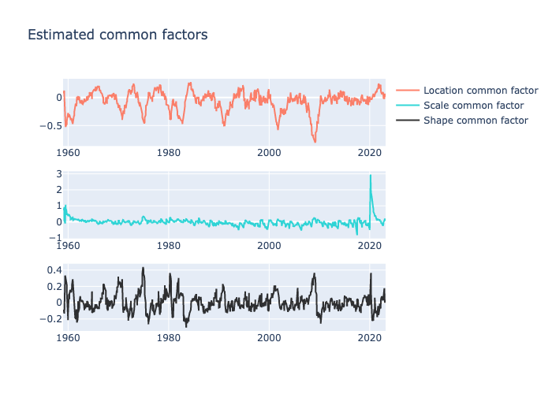

# ScoreJAX

`JAX` (Bradbury et al. 2018) implementation of the monthly score-driven
model featuring location, scale and shape common factors from Labonne P.
(2024). “Asymmetric uncertainty: Nowcasting using skewness in real-time
data”. *International Journal of Forecasting*

`JAX` adds automatic differentiation and high-performance numerical
computing features to code written in Python.

#### First install all necessary python libraries

``` python
pip install -r requirements.txt
```

#### `R` code for building a dataframe from fred-md vintages. The data is saved in the `arrow` `parquet` for easy interoperability with `Python`.

``` python
%%bash

# first install all necessary packages
Rscript "R/install.R"

# build the dataframe
Rscript "R/build_data.R"
```

    First and last 5 rows of the dataframe:

    |date     |     INDPRO|        RPI|     CUMFNS|     CE16OV|     UNRATE|    PAYEMS| DPCERA3M086SBEA|    RETAILx|    S&P 500|
    |:--------|----------:|----------:|----------:|----------:|----------:|---------:|---------------:|----------:|----------:|
    |Feb 1959 |  1.7255071|  0.1130303|  1.4737351| -0.6116128| -0.2237881| 0.4348335|       0.9264855|  0.1667342| -0.5828727|
    |Mar 1959 |  1.2207666|  0.3239591|  1.2241315|  1.1847559| -0.6863837| 0.8010025|       0.8120093|  0.2314802|  0.5432734|
    |Apr 1959 |  1.8927444|  0.3293625|  1.7922927|  0.9829976| -0.9176815| 0.7346453|      -0.7482070| -0.2618204|  0.3077374|
    |May 1959 |  1.2851759|  0.2676544|  1.0937802| -0.3392399| -0.2237881| 0.4839772|       1.1223013|  0.1983307|  0.2618048|
    |Jun 1959 | -0.0859234|  0.0430532| -0.1707683|  0.1670681| -0.2237881| 0.1737772|       0.1302969|  0.2790557| -0.3953918|
    |Nov 2022 | -0.5256372| -0.0117060| -0.7436524| -0.2419711| -0.2237881| 0.0791369|      -0.8085951| -1.1463561|  1.2401924|
    |Dec 2022 | -1.7480482| -0.1247455| -2.0180009|  0.4959994| -0.2237881| 0.0229809|      -0.5448329| -0.7617474| -0.1905822|
    |Jan 2023 |  0.7253275| -0.2422374|  1.2686445|  0.6585428| -0.2237881| 0.2758757|       1.2990035|  1.4685790|  0.1870982|
    |Feb 2023 |  0.0072687| -0.1982741|  0.4528868| -0.0142540|  0.4701053| 0.1161223|      -0.6048122| -0.7715735|  0.6697893|
    |Mar 2023 |  0.1741411| -0.0303539| -0.5881519|  0.3582568| -0.2237881| 0.0179953|      -0.3499326| -0.7113823| -0.9228394|

#### Load the dataframe in `Python`

``` python
import pyarrow.parquet as pq
import numpy as np
import pandas as pd

# load the data
df = pq.read_table("data/df.parquet").to_pandas()
df_np = df.to_numpy() # for easy use with JAX

# deal with the date for plotting later
# Function to convert yearmon from numeric format
def convert_yearmon(yearmon):
    year = int(yearmon)
    month = int((yearmon - year) * 12 + 1)  # Adjusting for base-1 index
    return pd.Timestamp(year=year, month=month, day=1)

# Apply the conversion function
df['date'] = pd.to_numeric(df['date'])
df['date'] = df['date'].apply(convert_yearmon)
```

#### Estimation with maximum likelihood

``` python
import sys
sys.path.append('src') # to find sdfm
from sdfm import build_model
from sdfm import mle

import jax
import jax.numpy as jnp
from jax import random

# convert the data to a JAX type
y = jnp.array(df_np[:, 1:])

# build the model
slack_model = build_model(y)

# estimation with maximum likelihood
key = jax.random.PRNGKey(123)
mle_result = mle(model=slack_model, iter=50, pertu=0.25, key=key)

print("ML at", -mle_result.fun)
```

    ML at -5098.0634765625

#### Plot of the estimated common factors

``` python
import plotly.graph_objects as go
from plotly.subplots import make_subplots
import plotly.io as pio

from sdfm import sd_filter

# plot
estimated_filter = sd_filter(mle_result.x, slack_model)
a_loc = estimated_filter[2]
a_scale = estimated_filter[2]
a_shape = estimated_filter[2]

factor_loc = estimated_filter[0][:, y.shape[1]]
factor_scale = estimated_filter[1][:, y.shape[1]]
factor_shape = estimated_filter[2][:, y.shape[1]]

# Create a figure with subplots
fig = make_subplots(rows=3, cols=1)

# Adding each array to the plot
fig.add_trace(
    go.Scatter(
        x = df['date'],
        y=factor_loc,
        mode="lines",
        name="Location common factor",
        line=dict(color="tomato"),
    ),
    row=1,
    col=1,
)
fig.add_trace(
    go.Scatter(
        x = df['date'],
        y=factor_scale,
        mode="lines",
        name="Scale common factor",
        line=dict(color="#00CDCD"),
    ),
    row=2,
    col=1,
)
fig.add_trace(
    go.Scatter(
        x = df['date'],
        y=factor_shape,
        mode="lines",
        name="Shape common factor",
        line=dict(color="black"),
    ),
    row=3,
    col=1,
)

fig.update_traces(opacity=0.8)

# Update layout
fig.update_layout(
    title="Estimated common factors", yaxis_title="", xaxis_title="", showlegend=True
)

# Show the plot
pio.write_image(fig, "plots/factors.png")
```



Bradbury, James, Roy Frostig, Peter Hawkins, Matthew James Johnson,
Chris Leary, Dougal Maclaurin, George Necula, et al. 2018. “JAX:
Composable Transformations of Python+NumPy Programs.”
<http://github.com/google/jax>.
