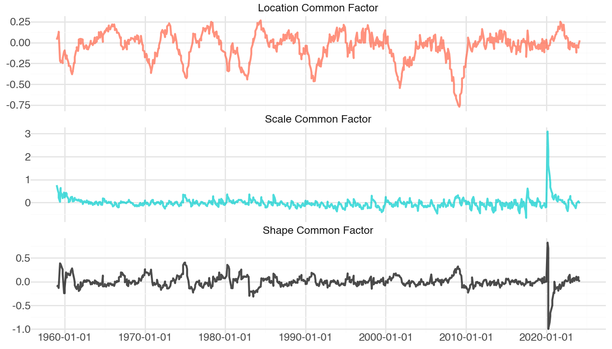

# ScoreJAX

JAX (Bradbury et al. 2018) implementation of the score-driven model
featuring location, scale and shape common factors introduced in Labonne
P. (2024). “Asymmetric uncertainty: Nowcasting using skewness in
real-time data”. *International Journal of Forecasting*

JAX adds automatic differentiation and high-performance numerical
computing features to code written in Python.

#### First install all necessary python libraries

``` python
pip install -r requirements.txt
```

#### R code for building a dataframe from fred-md vintages. The dataframe is saved in the `arrow` `parquet` format for easy interoperability with Python.

``` python
%%bash

# first install all necessary packages
Rscript "R/install.R"

# build the dataframe
Rscript "R/fredmd.R"
```

    First and last 5 rows of the dataframe:

    |date     |     INDPRO|     CE16OV|     CUMFNS| DPCERA3M086SBEA|     PAYEMS|    RETAILx|        RPI|     UNRATE|
    |:--------|----------:|----------:|----------:|---------------:|----------:|----------:|----------:|----------:|
    |Feb 1959 |  1.7382786| -0.6128983|  1.4815090|       0.9669602|  0.4387042|  0.1691631|  0.1101987| -0.2245379|
    |Mar 1959 |  1.2308349|  1.1933739|  1.2307785|       0.8486294|  0.8080251|  0.2341810|  0.3291290| -0.6866133|
    |Apr 1959 |  1.9064116|  0.9905033|  1.8015046|      -0.7826956|  0.7410967| -0.2611915|  0.3336894| -0.9176510|
    |May 1959 |  1.2955892| -0.3390238|  1.0998389|       1.1790249|  0.4882709|  0.2008923|  0.2730984| -0.2245379|
    |Jun 1959 | -0.0828532|  0.1700756| -0.1704180|       0.1269771|  0.1754008|  0.2819564|  0.0415569| -0.2245379|
    |Nov 2023 |  0.1624801|  0.3674587|  0.3635406|       0.1899331| -0.0425832| -0.2337638|  0.1138308| -0.2245379|
    |Dec 2023 | -0.5106774| -0.8151388| -0.0860901|       0.2441512|  0.0738307| -0.0673339| -0.0443199|  0.0064998|
    |Jan 2024 | -0.9816326| -0.2075112| -1.1741701|      -0.7242012|  0.0366090| -1.0016218|  0.2957077|  0.0064998|
    |Feb 2024 |  0.2422712| -0.3505441|  0.9614271|       0.2730607|  0.0512261|  0.3503235| -0.2717004|  0.4685752|
    |Mar 2024 |  0.1906866|  0.2864882|  0.3234521|       0.3124255|  0.0861743|  0.1523103| -0.0566724| -0.2245379|

#### Load the dataframe in `Python`

``` python
import pyarrow.parquet as pq

# load the data
df = pq.read_table("data/df.parquet").to_pandas()
```

#### Estimation with maximum likelihood

``` python
import sys
sys.path.append('src') # to find sdfm
from sdfm import build_model
from sdfm import mle

import jax
import jax.numpy as jnp
from jax import random

# convert the data to a JAX type
df_np = df.to_numpy() # for easy use with JAX
y = jnp.array(df_np[:, 1:])

# build the model
slack_model = build_model(y)

# estimation with maximum likelihood
key = jax.random.PRNGKey(123)
mle_result = mle(model=slack_model, iter=50, pertu=0.25, key=key)

print("ML at", -mle_result.fun)
```

    ML at -5098.0634765625

#### Run the filter with the estimated parameters

``` python
from sdfm import sd_filter

estimated_filter = sd_filter(mle_result.x, slack_model)
```

#### Plot of the estimated common factors



<div id="refs" class="references csl-bib-body hanging-indent">

<div id="ref-jax2018github" class="csl-entry">

Bradbury, James, Roy Frostig, Peter Hawkins, Matthew James Johnson,
Chris Leary, Dougal Maclaurin, George Necula, et al. 2018. “JAX:
Composable Transformations of Python+NumPy Programs.”
<http://github.com/google/jax>.

</div>

</div>
